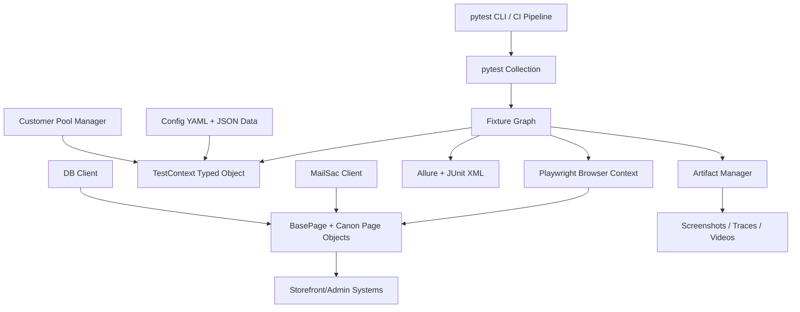

# Canon LATAM Automation Framework Architecture (Python + Playwright Target)

## 1. Purpose

This document defines the target architecture if the current Java + Selenium + TestNG framework is migrated to a Python + Playwright framework.

It is designed to preserve business coverage while improving stability, speed, and maintainability.

Primary goals:

- Keep full Canon LATAM business coverage (Chile, Mexico, Panama; storefront + admin + email + optional DB checks).
- Reduce flaky behavior by using Playwright auto-waits and deterministic fixtures.
- Improve developer productivity with Python ecosystem tooling.
- Improve observability with richer traces, screenshots, and video artifacts.

## 2. Target Technology Stack

- Language: Python 3.12
- UI engine: Playwright (sync API for easier migration, optional async for advanced cases)
- Test runner: pytest
- Parallelization: pytest-xdist
- Assertions: pytest + Playwright expect API
- Reporting: Allure (or Playwright HTML report style equivalent), plus JUnit XML for CI
- Data modeling/validation: pydantic
- Lint/format/type checks: ruff + black + mypy
- Dependency management: poetry or uv + requirements lock strategy
- Logging: structlog or standard logging with JSON-friendly formatter

## 3. Architectural Principles

1. Keep layered boundaries clear:
   - Framework core
   - Canon domain pages and flows
   - Test scenarios
   - Data/config
2. Prefer explicit fixtures over hidden global state.
3. Use context objects (typed) instead of weakly typed dictionaries where possible.
4. Keep tests declarative; keep technical actions inside page/flow layers.
5. Shift from wait-heavy Selenium patterns to Playwright-first waiting semantics.
6. Keep migration incremental with side-by-side execution until parity is proven.

## 4. Proposed Repository Layout

```text
canon-automation-python/
  pyproject.toml
  pytest.ini
  README.md
  .env.example

  config/
    general/
      framework-settings.yaml
      logging.yaml
    canon/
      stage/
      qa/
      hotfix/
      smoke/

  src/
    framework/
      core/
        browser_manager.py
        context.py
        exceptions.py
        logger.py
        retry.py
      ui/
        base_page.py
        components/
      data/
        config_loader.py
        models.py
      integrations/
        mail/
          mailsac_client.py
        db/
          postgres_client.py
          oracle_client.py
      reporting/
        artifact_manager.py
        step_reporter.py

    canon/
      pages/
        latam_page.py
        home_page.py
        login_page.py
        admin/
      flows/
        checkout_flow.py
        admin_order_flow.py
      region/
        bootstrap.py
        customer_pool.py

  tests/
    conftest.py
    fixtures/
      browser_fixtures.py
      region_fixtures.py
      data_fixtures.py
    chile/
      e2e/
      smoke/
    mexico/
      e2e/
      smoke/
    panama/
      e2e/
      smoke/

  reports/
  artifacts/
    screenshots/
    traces/
    videos/
```

## 5. High-Level Component Model



## 6. Layer-by-Layer Target Design

### 6.1 Framework Core Layer (`src/framework`)

Responsibilities:

- Browser/session lifecycle abstraction over Playwright.
- Unified error model with business/automation/environment categories.
- Config loading and schema validation.
- Utility services for retries, timeouts, and diagnostics.

Key modules:

- `browser_manager.py`: launches browser, creates contexts/pages, applies timeouts and context options.
- `context.py`: typed per-test runtime context (region, env, test id, credentials, dynamic values).
- `exceptions.py`: migration of exception taxonomy for triage consistency.
- `artifact_manager.py`: screenshot/trace/video policy.
- `step_reporter.py`: structured step logging for readable reports.

### 6.2 UI Abstraction Layer (`src/framework/ui`)

Responsibilities:

- Common page operations and defensive wrappers.
- Selector strategy helpers.
- Reusable UI components for menus, modals, carts, tables.

Playwright design approach:

- Replace direct `By` and driver calls with `Locator` objects.
- Prefer semantic locators (`get_by_role`, `get_by_label`, `get_by_text`) over fragile CSS/XPath where possible.
- Use Playwright expect-based waits (`expect(locator).to_be_visible()`) instead of generic polling loops.

### 6.3 Canon Domain Layer (`src/canon`)

Responsibilities:

- Canon page objects for storefront/admin domains.
- Region-aware behavior and data rules.
- Business flows that represent meaningful operations.

Recommended split:

- `pages/`: low-level page interactions.
- `flows/`: multi-page business transactions (checkout, shipment, promotion validation).
- `region/`: region bootstrap and user pool allocation services.

### 6.4 Test Layer (`tests`)

Responsibilities:

- Scenario declarations and assertions.
- Marker-based categorization (`@pytest.mark.chile`, `@pytest.mark.e2e`, `@pytest.mark.smoke`).
- Data parameterization via fixtures.

Pytest fixture model replaces TestNG annotation lifecycle:

- Session fixtures: environment bootstrapping, customer pools, shared metadata.
- Function fixtures: browser context/page, test context initialization, artifact hooks.
- Autouse fixtures: failure diagnostics, tracing toggles, and cleanup.

### 6.5 Configuration and Data Layer

Responsibilities:

- Environment and region-specific settings.
- Structured data catalogs (products, payment methods, addresses, ML test payloads).
- Secret injection from CI/environment variables.

Strong recommendation:

- Keep existing `config/canon/<env>/<region>` shape to minimize migration friction.
- Introduce pydantic schemas to validate each data payload at load time.

## 7. Lifecycle Mapping: Java Selenium to Python Playwright

| Current Java Concept | Python Playwright Equivalent | Notes |
|---|---|---|
| `BaseTest` + TestNG annotations | `pytest` fixtures (`session`, `function`, `autouse`) | Explicit dependency graph, less hidden ordering |
| `ThreadLocal<WebAutomator>` | fixture-scoped context object per test process | xdist worker isolation replaces thread-local style |
| `WebAutomator` | `BrowserManager` + `TestContext` + `Page`/`Context` wrappers | Split responsibilities for clarity |
| `BasePage` wrappers | Playwright `Locator`-first BasePage | Less custom wait code needed |
| `Sync` implicit/explicit/fluent waits | Playwright auto-wait + `expect` | Remove most manual wait complexity |
| `Memory` dictionary | typed `TestContext` (+ optional dict extras) | Better IDE support and refactor safety |
| `SparkConfig` + Extent | Allure + JUnit + trace/video artifacts | Rich diagnostics in CI |
| `CustomerTracker` | process-safe pool manager with lock | Keep behavior, modernize concurrency control |

## 8. Runtime Execution Flow (Target)

1. `pytest` collects tests by markers, paths, or keywords.
2. Session fixtures load config/data catalogs and initialize customer pools.
3. Function fixture creates Playwright browser context and page.
4. Region fixture builds typed `TestContext` and binds credentials/data.
5. Test executes via page objects and flow classes.
6. On failure, fixture hook captures screenshot + trace + video + console logs.
7. Reporting plugins produce Allure/JUnit outputs for CI publication.
8. Fixture finalizers release users/resources and close browser context.

## 9. Parallelization and State Strategy

### 9.1 Parallel Strategy

- Use `pytest -n <workers>` with pytest-xdist.
- Default unit of parallelism: test function.
- Keep one browser context per test for isolation.

### 9.2 Shared State Controls

- Customer pool manager must be process-safe:
  - Option A: file lock + JSON state
  - Option B: Redis-based lease model (recommended for CI scale)
- Artifact directory must include worker/test identifiers to avoid collisions.
- Test data files remain read-only during test run.

## 10. Reporting, Diagnostics, and Observability

Minimum diagnostic set for each failed test:

- Full-page screenshot
- Playwright trace archive
- Video capture (for e2e suites)
- Browser console logs
- Network failure events (optional but recommended)

Recommended report outputs:

- Allure report for rich UI drill-down.
- JUnit XML for Jenkins/GitHub Actions trend dashboards.
- Optional lightweight HTML summary for fast triage.

## 11. Security and Secrets Architecture

Current state in Java repository includes plain credentials in config files. Target state should be:

- Non-secret metadata in repo config.
- Secrets from environment variables or vault (Azure Key Vault, Jenkins Credentials, etc.).
- Runtime secret provider injected into `TestContext`.
- API keys (for mail services) never hardcoded in source.

## 12. CI/CD Target Design

### 12.1 Pipeline Stages

1. Setup Python runtime and cache dependencies.
2. Lint/format/type check (`ruff`, `black --check`, `mypy`).
3. Run smoke tests first.
4. Run selected e2e suites in parallel.
5. Publish Allure results, JUnit XML, and artifacts.

### 12.2 Example Commands

```bash
python -m pip install -U pip
pip install -r requirements.txt
playwright install --with-deps chromium
pytest -m smoke -n 3 --junitxml=reports/junit-smoke.xml
pytest -m e2e -n 6 --junitxml=reports/junit-e2e.xml
```

## 13. Migration Blueprint (Java -> Python)

### Phase 0: Discovery and Baseline (2-3 person-weeks)

- Freeze scope for first migration wave.
- Classify tests by business criticality and flakiness.
- Capture baseline metrics (pass rate, runtime, defect leakage).

Exit criteria:

- Signed migration backlog with prioritized scenarios.

### Phase 1: Framework Foundation (3-5 person-weeks)

- Create Python project skeleton and tooling.
- Implement browser manager, base page, config loader, context model.
- Integrate reporting, screenshots, and trace capture.

Exit criteria:

- Framework can run sample tests reliably in CI.

### Phase 2: Vertical Slice Pilot (4-6 person-weeks)

- Migrate one end-to-end business flow per region (3-5 tests total).
- Implement region fixtures, customer pool, and mail verification equivalent.
- Validate parity and runtime improvements versus Java baseline.

Exit criteria:

- Pilot suite green and stable for 1-2 weeks in CI.

### Phase 3: Core Suite Migration (10-18 person-weeks)

- Migrate high-value smoke and e2e scenarios in batches.
- Keep Java and Python in dual-run mode until parity confidence is achieved.
- Refactor selectors to robust Playwright locator strategy.

Exit criteria:

- 70-85% critical coverage migrated and stable.

### Phase 4: Full Cutover and Hardening (6-10 person-weeks)

- Migrate remaining long-tail scenarios.
- Remove duplicate execution paths and retire obsolete Java suites.
- Optimize parallelism and quarantine policy for non-deterministic tests.

Exit criteria:

- Python framework is default pipeline path for all target suites.

## 14. Estimated Effort (Migration to Python Playwright)

### 14.1 Total Migration Estimate

For a codebase of current size and complexity:

- **25-42 person-weeks** for migration with parity and stabilization.

Team-based view:

- 4 engineers: about 7-11 calendar months (with ongoing release support)
- 6 engineers: about 5-8 calendar months

### 14.2 Why It Is Not a Simple Recode

Main complexity drivers:

- 50 test classes and deep business workflows.
- 34 page objects with mixed selector/wait patterns.
- Region-specific branches and payment differences.
- External dependencies (mail, admin state, optional DB checks).
- Need for side-by-side validation before cutover.

## 15. Key Risks and Mitigations

1. Risk: Selector instability during migration.
   Mitigation: Define locator policy and componentized selectors before bulk rewrite.
2. Risk: Data/credential drift between frameworks.
   Mitigation: Shared config catalogs and schema validation in CI.
3. Risk: Concurrency collisions on dynamic users.
   Mitigation: Process-safe leasing with strict release hooks.
4. Risk: Reporting gap during transition.
   Mitigation: Standard artifact contract and dual publishing in CI.
5. Risk: Team productivity dip on new stack.
   Mitigation: migration templates, coding standards, and first-wave pair implementation.

## 16. Recommended First 8 Weeks Plan

1. Week 1-2: foundation setup, coding standards, CI baseline, reporting pipeline.
2. Week 3-4: migrate one pilot flow per region, implement customer pool + mail client.
3. Week 5-6: migrate smoke pack and stabilize selector strategy.
4. Week 7-8: parallel tuning, artifact improvements, and release gating with Python smoke.

## 17. Definition of Done for Cutover

Migration can be considered complete when all are true:

- Critical smoke/e2e scenarios are implemented and green in Python pipeline.
- Flaky rate is lower than Java baseline by agreed threshold.
- Runtime is equal or better than Java baseline for comparable scope.
- Artifact quality supports triage without Java fallback.
- Secrets are externalized and CI controls are in place.

## 18. Detailed Migration Operating Model

To control a migration of this size, run five parallel workstreams with clear ownership and weekly checkpoints.

### 18.1 Workstream A: Framework Platform

Scope:

- Core Playwright wrappers, fixture system, artifact manager, reporting hooks, error taxonomy.
- CI templates, test command contracts, environment bootstrap.

Outputs:

- Versioned internal framework package.
- Migration templates for pages, flows, and tests.

### 18.2 Workstream B: Domain Migration (Pages and Flows)

Scope:

- Storefront/admin page objects.
- Business flow classes for reusable end-to-end actions.

Outputs:

- Region-capable flow library.
- Selector catalog and stability scorecard.

### 18.3 Workstream C: Scenario Migration

Scope:

- Test class conversion from Java to pytest.
- Marker mapping, parametrization, parity validation.

Outputs:

- Wave-based converted test packs.
- Traceable migration matrix from old class to new test module.

### 18.4 Workstream D: Data and Environment Reliability

Scope:

- Schema validation for JSON assets.
- Dynamic user pool hardening.
- Synthetic data generation where needed.

Outputs:

- Data quality gates in CI.
- Reduced environment-coupled failures.

### 18.5 Workstream E: Quality and Economics

Scope:

- Flaky triage, quarantine policy, runtime optimization.
- Cost/performance monitoring of parallel workers.

Outputs:

- Weekly stability dashboard.
- Cost-to-run trendline with optimization backlog.

## 19. Wave-Based Detailed Migration Plan

The migration should use controlled waves, each with strict entry and exit criteria.

### 19.1 Wave 0: Preparation and Baseline

Duration: 2 weeks

Tasks:

1. Build inventory of all Java tests, pages, and data dependencies.
2. Assign each test a migration score (criticality, complexity, flakiness, external dependencies).
3. Define pass-rate and runtime baseline from current Java pipeline.

Deliverables:

- Migration backlog and priority map.
- Baseline metrics report.

### 19.2 Wave 1: Foundation and Pilot

Duration: 3-4 weeks

Tasks:

1. Build framework skeleton and fixture graph.
2. Migrate 3-5 representative flows (one per region minimum).
3. Prove artifact quality: trace, screenshot, video, and step logs.

Deliverables:

- Pilot suite stable in CI.
- Updated migration templates based on pilot findings.

### 19.3 Wave 2: Smoke-First Migration

Duration: 4-6 weeks

Tasks:

1. Migrate all smoke tests first.
2. Stabilize selectors in high-traffic pages.
3. Enforce CI gate: Python smoke required, Java smoke informational.

Deliverables:

- Python smoke as primary gate.
- Flaky rate below agreed threshold.

### 19.4 Wave 3: E2E Core Pack

Duration: 6-10 weeks

Tasks:

1. Migrate critical e2e purchase/order/admin validation scenarios.
2. Move shared logic from tests into flow layer to avoid duplication.
3. Run parity checks in dual-run mode (Java + Python) for critical packs.

Deliverables:

- 70-85% critical coverage in Python.
- Dual-run parity report with signed acceptance.

### 19.5 Wave 4: Long Tail and Decommission

Duration: 4-6 weeks

Tasks:

1. Migrate or retire low-value/duplicate scenarios.
2. Remove obsolete Java CI stages gradually.
3. Finalize runbooks, ownership, and SLOs.

Deliverables:

- Python-only primary pipeline.
- Java framework archived with rollback path.

## 20. Prioritization Framework (What to Migrate First)

Use a weighted score per scenario:

Migration Priority Score =

- 35% business criticality
- 20% execution frequency in CI
- 15% defect detection value
- 15% technical complexity (inverse)
- 10% data/environment coupling (inverse)
- 5% flakiness trend (inverse, stabilize early)

Operational interpretation:

- High score: migrate in Wave 1-2.
- Medium score: migrate in Wave 3.
- Low score: migrate late, merge, or retire.

## 21. Efficiency Strategies to Reduce Effort While Preserving Quality

### 21.1 Test Portfolio Rationalization Before Migration

Strategy:

- Identify duplicates, near-duplicates, and low-signal tests before converting.
- Consolidate similar cases using parametrization.

Expected benefit:

- 15-30% less migration volume.

### 21.2 Flow-First Migration Instead of Test-by-Test Rewrite

Strategy:

- Migrate reusable business flows first (login, add-to-cart, checkout, admin verification).
- Rewrite tests to orchestrate existing flows, not raw UI steps.

Expected benefit:

- Higher reuse, lower maintenance cost, faster migration velocity.

### 21.3 Template-Driven Conversion

Strategy:

- Create standard templates for page object, flow object, and test module.
- Use a fixed naming and fixture contract.

Expected benefit:

- Lower onboarding cost and fewer structural defects.

### 21.4 Automated Locator Modernization

Strategy:

- Build scripts to scan existing selectors and suggest semantic Playwright locators.
- Maintain a selector catalog with stability score and fallback chain.

Expected benefit:

- Reduced flaky failures and rework loops.

### 21.5 Data Contract Validation in CI

Strategy:

- Validate all JSON files with pydantic schemas on every pull request.
- Fail fast on broken or incomplete data.

Expected benefit:

- Prevents late pipeline failures and triage churn.

### 21.6 Selective Dual-Run Strategy

Strategy:

- Run Java + Python in parallel only for top critical packs.
- For non-critical packs, use sampling instead of full duplication.

Expected benefit:

- Lower CI cost while keeping migration confidence.

### 21.7 Quarantine and Auto-Triage for Flaky Tests

Strategy:

- Auto-tag unstable tests and route to stabilization queue.
- Keep release gates focused on stable critical scenarios.

Expected benefit:

- Faster feedback for developers and more predictable release cycles.

### 21.8 Shift-Left Validation Gates

Strategy:

- Enforce lint, type checks, and lightweight smoke on PR before merge.
- Reserve heavy e2e packs for post-merge or scheduled windows.

Expected benefit:

- Reduced cost per change and shorter PR cycle time.

## 22. Automation Accelerators (Highly Recommended)

1. Inventory generator:
  - Parse Java classes to build migration matrix automatically.
2. Selector extractor:
  - Scan Java page classes and export locator usage frequency.
3. Template generator:
  - Generate Python page/flow/test skeletons from migration metadata.
4. Data mapper:
  - Pre-map ML test IDs to target pytest modules.
5. Parity harness:
  - Compare Java and Python outputs for selected checkpoints.

These tools typically reduce manual migration effort by 20-35% when adopted early.

## 23. KPI and Governance Model

Track migration with objective weekly KPIs:

### 23.1 Delivery KPIs

- Converted tests per sprint.
- Converted pages/flows per sprint.
- Remaining backlog by wave.

### 23.2 Quality KPIs

- Pass rate trend by suite.
- Flaky rate trend by region.
- Defect escape rate for migrated coverage.

### 23.3 Performance and Cost KPIs

- Median and P95 runtime per suite.
- CI minutes consumed per 100 tests.
- Artifact storage growth rate.

### 23.4 Suggested Control Gates

- Gate A (Pilot complete):
  - >= 95% pass rate for pilot set over 10 consecutive runs.
- Gate B (Smoke cutover):
  - Python smoke runtime <= Java smoke runtime + 10% and flaky <= 2%.
- Gate C (Critical e2e cutover):
  - >= 98% parity for critical assertions in dual-run window.

## 24. Team Topology and Responsibilities

Recommended structure:

- Migration Lead (1): roadmap, risks, release decisions.
- Framework Engineers (2): core engine, fixtures, CI, reporting.
- Domain Engineers (2-3): pages/flows by region.
- Quality Analyst (1): parity validation, defect trend analysis.
- DevOps Support (part-time): pipeline cost/performance optimization.

Operating cadence:

- Daily 15-min migration standup.
- Weekly architecture and risk review.
- Bi-weekly wave checkpoint and go/no-go decision.

## 25. Detailed Cost Reduction Strategy

### 25.1 CI Resource Optimization

- Use worker count by suite profile (smoke, e2e-critical, e2e-full).
- Avoid over-parallelization that creates environment contention.
- Use test sharding based on historical duration.

### 25.2 Smart Execution Policy

- PR: run lint + type + smoke subset.
- Main branch: run full smoke + selected critical e2e.
- Nightly: full regression with traces/videos enabled.

### 25.3 Artifact Retention Policy

- Keep full artifacts for failures and nightly runs.
- Keep reduced artifacts for successful PR runs.
- Apply lifecycle policies to reduce storage spend.

### 25.4 Reuse Index Target

Set a target that at least 70% of migrated tests use shared flows rather than direct page chaining.

This directly reduces long-term maintenance cost.

## 26. Rollback and Safety Strategy

During transition, always keep controlled rollback options:

1. Dual pipeline mode (Java as fallback gate for defined period).
2. Release toggles for switching gate ownership between Java and Python.
3. Versioned migration checkpoints to roll back framework changes quickly.
4. Clear incident runbook for migration-related CI failures.

## 27. 12-Week Detailed Execution Plan

### Weeks 1-2

- Inventory, baseline metrics, migration score model.
- Framework skeleton, coding standards, CI bootstrap.

### Weeks 3-4

- Pilot flows in all regions.
- First selector catalog and artifact pipeline validation.

### Weeks 5-6

- Smoke migration wave.
- Enable smoke gate in Python.

### Weeks 7-8

- Core e2e migration batch 1.
- Start selective dual-run parity checks.

### Weeks 9-10

- Core e2e migration batch 2.
- Cost and runtime tuning of parallel workers.

### Weeks 11-12

- Long-tail migration/retirement decisions.
- Cutover readiness review and go/no-go.

## 28. Practical Migration Rules (Do and Avoid)

Do:

1. Migrate stable selectors first and isolate unstable components.
2. Keep page objects thin and move business logic to flows.
3. Make every flaky failure reproducible with trace/video artifacts.
4. Keep one source of truth for region data contracts.

Avoid:

1. Direct one-to-one copy of Selenium wait patterns into Playwright.
2. Embedding business decisions directly in low-level page methods.
3. Running full dual-run for all tests for long periods (too costly).
4. Deferring data/secret refactoring until late cutover.

---

This architecture should be used as the blueprint for planning, implementation, and governance of the Java-to-Python Playwright transformation.